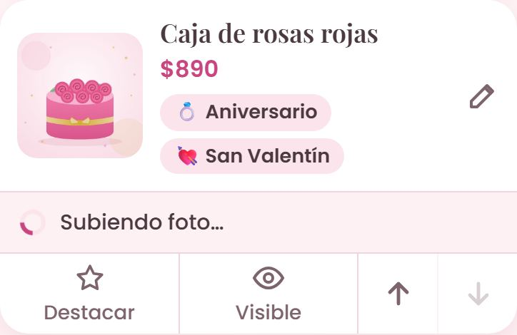
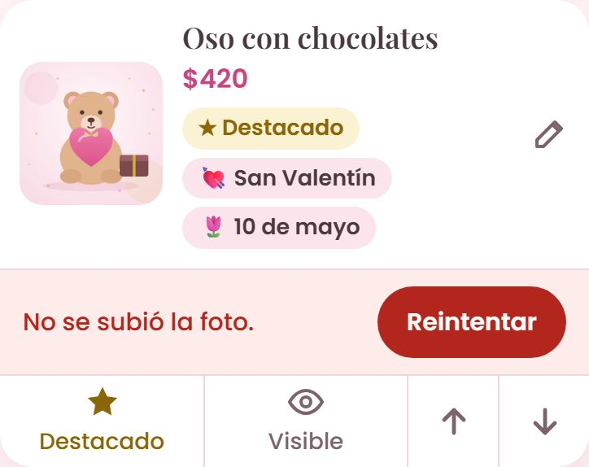
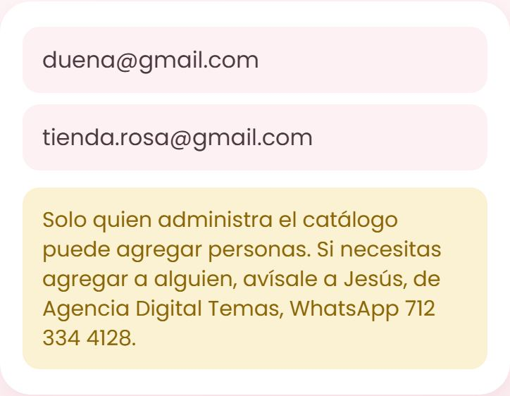
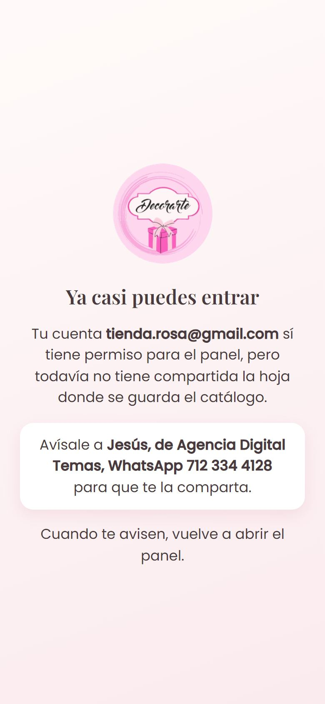
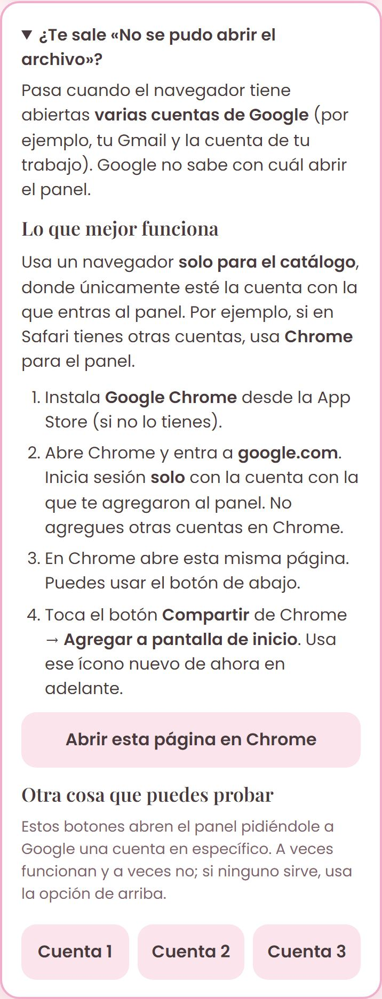

# Manual de tu catálogo Decorarte 💕

Con tu celular puedes subir productos, cambiar precios, poner fotos y elegir qué se destaca.
Todo lo que guardas aparece en tu catálogo en unos segundos. No necesitas abrir ninguna hoja de cálculo.

**Tu catálogo:** https://tapqr-temascalcingo.github.io/decorarte-catalogo/
Compártelo en tu WhatsApp, Instagram y Facebook, o ponlo en un código QR en el mostrador.

---

## 1. Así lo ven tus clientes

- Arriba eligen **Regalos** o **Servicios**, y abajo la **ocasión** (Baby shower, 10 de mayo…).
- En **Temporada** salen tus productos destacados de la ocasión que tú elijas.
- Al tocar **Lo quiero**, se abre WhatsApp con un mensaje listo para ti: *"¡Hola Decorarte! Lo quiero: Caja de rosas eternas ($650)…"*.
- En Servicios, cada paquete tiene su botón **Cotizar**.

---

## 2. Entrar a tu panel

Toca el ícono **Decorarte** de tu pantalla de inicio. Si todavía no lo tienes, abre
https://tapqr-temascalcingo.github.io/decorarte-catalogo/panel/ y sigue las instrucciones de esa página.

Entras con **tu propio correo de Google** (tu Gmail). Solo pueden entrar las personas que la agencia agregó.

> 💡 Usa el panel siempre en el mismo navegador, donde **solo** esté la cuenta con la que entras al panel (por ejemplo, Chrome).
> Si ahí tienes abiertas otras cuentas de Google, Google se confunde. Lo explicamos en la sección 9.

### La primera vez

1. **Te llega un correo de Google** que dice que te compartieron la hoja **"Decorarte – Catálogo"**. Es normal: es la hoja donde
   se guarda tu catálogo. No tienes que hacer nada con ese correo.
2. Al tocar el ícono por primera vez, Google te pide **iniciar sesión**: entra con tu Gmail.
3. Sale una pantalla que dice **"Google no verificó esta app"**. Es normal: es una app hecha solo para tu catálogo.
   Toca **Configuración avanzada** (o **Avanzado**) y después **Ir a Decorarte Panel (no seguro)**.
4. Sale **"Decorarte Panel quiere acceder a tu Cuenta de Google"** con una lista de permisos (tus hojas de cálculo, solo los
   archivos de Drive que uses con esta app, y tu correo). Toca **Continuar** o **Permitir**.
5. Listo: aparece **Tus productos**. Las siguientes veces entras directo.

Abajo siempre tienes tres botones grandes: **Productos**, **Paquetes** y **Ajustes**.

---

## 3. Agregar un producto

1. Toca el botón rosa **＋ Agregar**, abajo a la derecha, en la barra de abajo.
2. **Foto:** toca **Tomar foto** para usar la cámara, o **Galería** para elegir una que ya tengas.
   El panel la hace más ligera solo, para que suba rápido y el catálogo cargue veloz.
3. Escribe el **Nombre** y una **Descripción** corta (qué incluye, si se personaliza…).
4. Elige la **Categoría**: Regalos o Servicios.
5. Marca **todas las ocasiones** que le queden. Un producto puede estar en varias.
6. **Precio:** elige una de tres opciones:
   - **Precio fijo**: se ve "$650".
   - **Desde…**: se ve "Desde $450", para cuando el precio cambia según lo que pidan.
   - **Pregunta por precio**: no muestra cantidad.

   Debajo te dice cómo se verá en el catálogo.
7. Toca **Guardar**. Verás el aviso verde **¡Producto agregado al catálogo!** al momento: no tienes que esperar a que suba la foto.

### Mientras se sube la foto

- La tarjeta del producto dice **"Subiendo foto…"**. Puedes seguir trabajando: agregar otro producto, cambiar precios, lo que quieras.
- Cuando termina, el aviso desaparece y la foto ya está en el catálogo.
- Si tu señal está débil y no se pudo subir, la tarjeta dice **"No se subió la foto"**. Toca **Reintentar** cuando tengas mejor señal.
  También se reintenta solo cuando el teléfono recupera la conexión.
- Si cierras el panel antes de que termine, no se pierde: la foto queda guardada en tu teléfono y se sube la próxima vez que abras el panel.

### Tus fotos viven en tu Google Drive: no borres la carpeta

Las fotos que subes se guardan en **tu** Google Drive, en una carpeta llamada **Decorarte Catálogo – Fotos**
(se crea sola la primera vez que subes una foto).

- **No borres esa carpeta ni las fotos que tiene.** El catálogo las muestra desde ahí: si las borras, en el catálogo
  aparece el logo en lugar de la foto.
- Si cambias o quitas la foto de un producto desde el panel, la vieja se va sola a la papelera de Drive.
- Si otra persona con acceso sube fotos con su propia cuenta, esas fotos quedan en el Drive **de esa persona**.

En la parte de abajo del formulario también están:

- **Visible en el catálogo**: apágalo para esconder el producto sin borrarlo.
- **Destacado**: le pone estrella y lo sube a la sección de Temporada si es de esa ocasión.
- **Lugar en la lista**: en qué posición aparece.

> 📸 **Consejos para tus fotos:** usa luz natural (junto a una ventana), un fondo liso y toma la foto cuadrada o con el producto al centro.
> Si no pones foto, en el catálogo se ve tu logo.

---

## 4. Cambios rápidos sin abrir el producto

Cada tarjeta tiene botones abajo:

| Botón | Qué hace |
|---|---|
| ☆ **Destacar** | Le pone o le quita la estrella. |
| 👁 **Visible / Oculto** | Lo muestra o lo esconde del catálogo. Ideal cuando se te acaba algo. |
| ↑ ↓ | Lo sube o lo baja en la lista. |

Estos cambios se ven **al momento**, sin esperar. Si tu señal está lenta, la tarjeta dice **"Guardando…"** unos segundos:
espera a que desaparezca antes de cerrar el panel.
Si no se pudo guardar, la tarjeta **regresa a como estaba** y sale un aviso rojo que dice qué no se guardó. Solo vuelve a tocar el botón.

Para **cambiar el nombre, la foto, el precio o las ocasiones**, toca la foto o el nombre del producto (o el lápiz ✏️).

---

## 5. Eliminar un producto

Abre el producto, baja hasta el final y toca **Eliminar producto**. Te pregunta antes de borrarlo.
Si solo quieres quitarlo por un tiempo, es mejor **ocultarlo**.

---

## 6. Paquetes de tus servicios

Cada servicio (charcutería, montaje de mesas, renta de mobiliario…) puede tener varios paquetes:

1. Primero crea el servicio en **Productos**, con la categoría **Servicios** y una buena foto.
2. Ve a **Paquetes** y toca **＋ Agregar paquete a…** debajo del servicio (o **＋ Agregar** en la barra de abajo).
3. Pon el nombre (por ejemplo, "Fiesta 25 personas"), el precio y **qué incluye**, una cosa por renglón.

En el catálogo, cada paquete tiene su botón **Cotizar** por WhatsApp.

---

## 7. Ajustes

- **Contacto y redes:** tu WhatsApp, Instagram, Facebook, la dirección y el enlace de Google Maps.
  Si quieres que las **cotizaciones de servicios** lleguen a otro número, ponlo en "WhatsApp para cotizar servicios". Si lo dejas vacío, todo llega a tu número de siempre.
- **Temporada destacada:** cámbiala según la fecha (San Valentín en febrero, 10 de mayo en abril–mayo, graduaciones en junio–julio…).
  Recuerda marcar como **Destacado** los productos que quieres arriba.
- **Ocasiones** y **Categorías:** agrega, cambia el nombre o quita las que ya no uses. El emoji es opcional.
  Una ocasión nueva (por ejemplo, **Navidad**) **no aparece en el catálogo hasta que tenga al menos un producto visible**.
  Mientras tanto, en Ajustes verás debajo la nota *"Aún sin productos: aparecerá en el catálogo cuando tenga al menos uno visible."*
  Para que aparezca, abre un producto y marca esa ocasión.
- **Personas con acceso:** aquí ves quién puede entrar al panel. **Solo la agencia puede agregar o quitar personas**:
  verás el aviso *"Solo quien administra el catálogo puede agregar personas"*. Si quieres que alguien te ayude, avísale a la agencia.

  

Cada sección tiene su propio botón **Guardar**.

---

## 8. Si algo no sale como esperabas

- **"Este panel es privado":** entraste con otra cuenta de Google, no con la que te agregaron. Abre el panel desde el ícono
  del navegador donde solo está tu cuenta (sección 9).
- **"Ya casi puedes entrar":** tu cuenta sí tiene permiso, pero falta que te compartan la hoja del catálogo.
  La pantalla te dice a quién avisar (la agencia). Cuando te avisen, vuelve a abrir el panel.
- **«No se pudo abrir el archivo»:** mira la sección 9.
- **Hice un cambio y no lo veo en el catálogo:** recarga la página del catálogo. Los cambios aparecen en unos segundos.
  Si es una ocasión nueva, recuerda que aparece hasta que tenga un producto.
- **"No se subió la foto":** toca **Reintentar** cuando tengas mejor señal.
- **Aparece un aviso rojo al guardar:** léelo. Casi siempre falta el nombre o el precio. Si dice otra cosa, toma captura de pantalla y mándala a quien te instaló el catálogo.
- **No hay internet:** el catálogo sigue mostrando a tus clientes lo último que vieron. El panel necesita internet para guardar.

---

## 9. Si te sale «No se pudo abrir el archivo»

**Por qué pasa:** tu teléfono tiene abiertas **dos o más cuentas de Google** en el mismo navegador (por ejemplo, tu Gmail y
la cuenta de tu trabajo o de tu familia). Google no sabe con cuál abrir el panel y muestra ese mensaje.
No es tu culpa ni se descompuso nada.

**La solución que mejor funciona: un navegador solo para el catálogo.**

1. Si en **Safari** tienes varias cuentas, usa **Google Chrome** para el panel. Si no lo tienes, descárgalo gratis de la App Store.
2. Abre **Chrome** y entra a **google.com**. Toca **Iniciar sesión** y entra **solo con el Gmail con el que te agregaron al panel**.
   No agregues otras cuentas en Chrome.
3. En Chrome, abre esta dirección: **tapqr-temascalcingo.github.io/decorarte-catalogo/panel/**
   (o, desde Safari, toca el ícono del panel y luego **Abrir esta página en Chrome**).
4. En Chrome toca el botón **Compartir** (el cuadrito con una flecha, arriba a la derecha) → **Agregar a pantalla de inicio**.
5. Listo: usa **ese ícono nuevo** de ahora en adelante. Puedes borrar el ícono viejo (déjalo presionado → **Eliminar**).

Tus otras cuentas siguen en Safari como siempre; solo el panel vive en Chrome.

**Si de todos modos necesitas entrar desde otro navegador:** cuando te salga el error, regresa al ícono. Verás la ayuda con
los botones **Cuenta 1**, **Cuenta 2** y **Cuenta 3**. Prueba uno por uno: a veces alguno abre el panel con la cuenta correcta,
pero no siempre funciona. Si ninguno sirve, usa la solución de arriba.

---

## Tu información está segura

- Todo queda guardado en la hoja **Decorarte – Catálogo**, que la agencia te compartió y sirve de respaldo. No necesitas abrirla;
  si la abres, **no cambies ni borres nada a mano**: todo se maneja desde el panel.
- Las fotos están en tu carpeta **Decorarte Catálogo – Fotos**. Las que borras o cambias van a la papelera de Drive, donde se pueden recuperar durante 30 días.
- En tu Drive, el panel solo puede tocar las fotos y la carpeta que él mismo creó. No puede ver tus demás archivos ni fotos.
