# Manual de tu catálogo Decorarte 💕

Con tu celular puedes subir productos, cambiar precios, poner fotos y elegir qué se destaca.
Todo lo que guardas aparece en tu catálogo en unos segundos. No necesitas abrir ninguna hoja de cálculo.

**Tu catálogo:** https://tapqr-temascalcingo.github.io/decorarte-catalogo/
Compártelo en tu WhatsApp, Instagram y Facebook, o ponlo en un código QR en el mostrador.

---

## 1. Así lo ven tus clientes

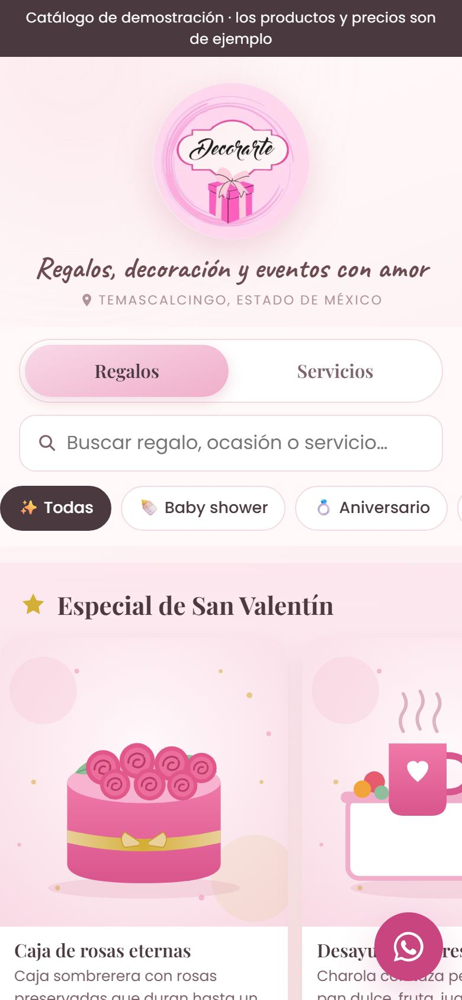
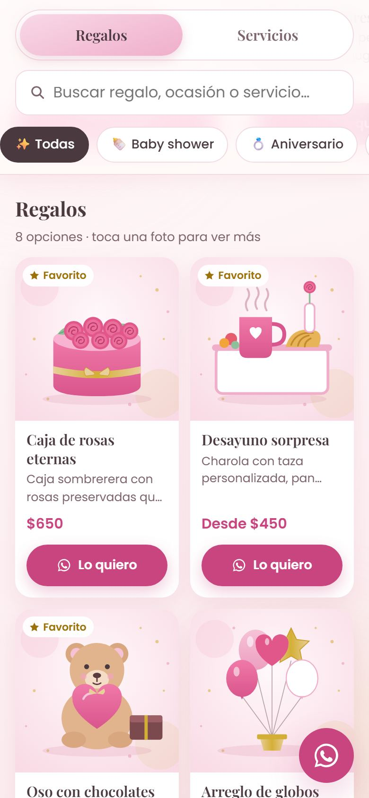
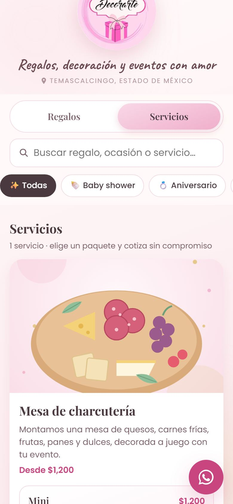

- Arriba eligen **Regalos** o **Servicios**, y abajo la **ocasión** (Baby shower, 10 de mayo…).
- En **Temporada** salen tus productos destacados de la ocasión que tú elijas.
- Al tocar **Lo quiero**, se abre WhatsApp con un mensaje listo para ti: *"¡Hola Decorarte! Lo quiero: Caja de rosas eternas ($650)…"*.
- En Servicios, cada paquete tiene su botón **Cotizar**.

---

## 2. Entrar a tu panel

Toca el ícono **Decorarte** de tu pantalla de inicio. Si todavía no lo tienes, abre
https://tapqr-temascalcingo.github.io/decorarte-catalogo/panel/ y sigue las instrucciones de esa página.

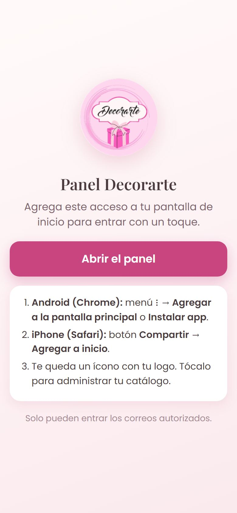

Entras con tu cuenta de Google. Nadie más puede entrar, salvo las personas que tú autorices.

Abajo siempre tienes tres botones grandes: **Productos**, **Paquetes** y **Ajustes**.

---

## 3. Agregar un producto

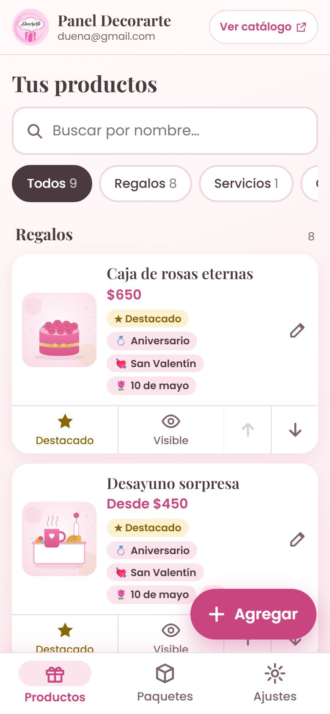
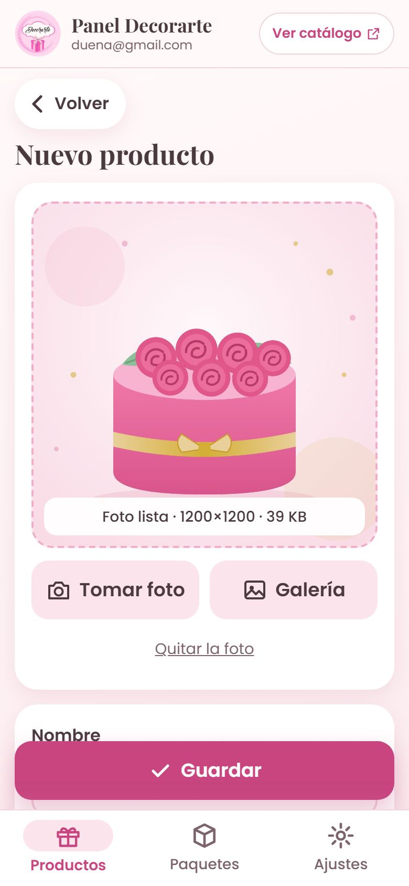
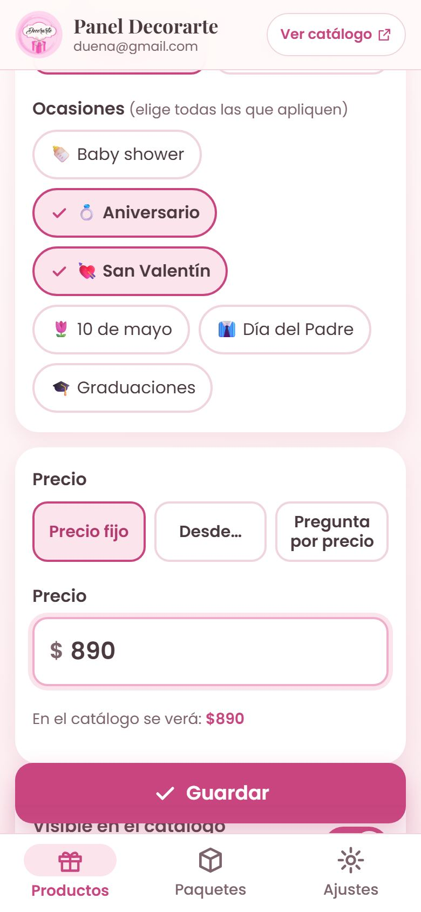

1. En **Productos**, toca el botón rosa **＋ Agregar**.
2. **Foto:** toca **Tomar foto** para usar la cámara, o **Galería** para elegir una que ya tengas.
   El panel la hace más ligera solo, para que suba rápido y el catálogo cargue veloz.
3. Escribe el **Nombre** y una **Descripción** corta (qué incluye, si se personaliza…).
4. Elige la **Categoría**: Regalos o Servicios.
5. Marca **todas las ocasiones** que le queden. Un producto puede estar en varias.
6. **Precio:** elige una de tres opciones:
   - **Precio fijo**: se ve "$650".
   - **Desde…**: se ve "Desde $450", para cuando el precio cambia según lo que pidan.
   - **Pregunta por precio**: no muestra cantidad.

   Debajo te dice cómo se verá en el catálogo.
7. Toca **Guardar**. Verás el aviso verde **¡Producto agregado al catálogo!**

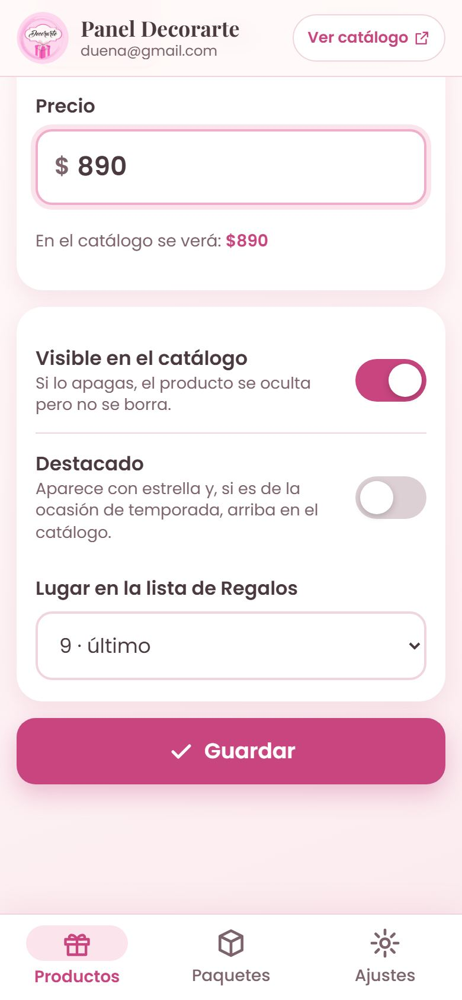
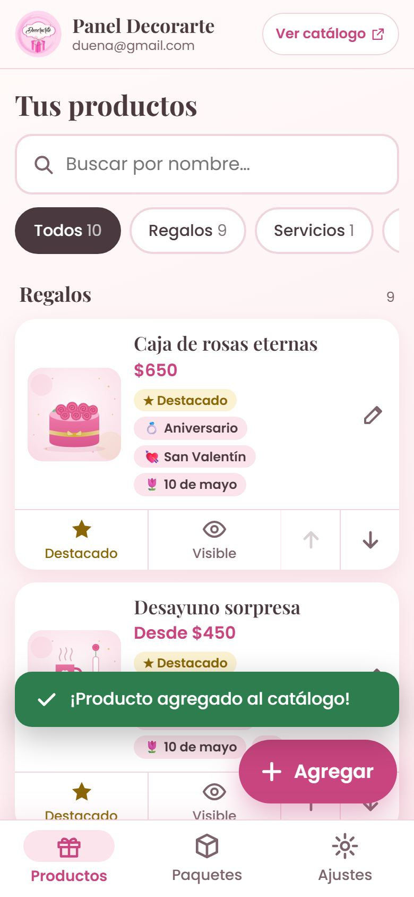

En la parte de abajo del formulario también están:

- **Visible en el catálogo**: apágalo para esconder el producto sin borrarlo.
- **Destacado**: le pone estrella y lo sube a la sección de Temporada si es de esa ocasión.
- **Lugar en la lista**: en qué posición aparece.

> 📸 **Consejos para tus fotos:** usa luz natural (junto a una ventana), un fondo liso y toma la foto cuadrada o con el producto al centro.
> Si no pones foto, en el catálogo se ve tu logo.

---

## 4. Cambios rápidos sin abrir el producto

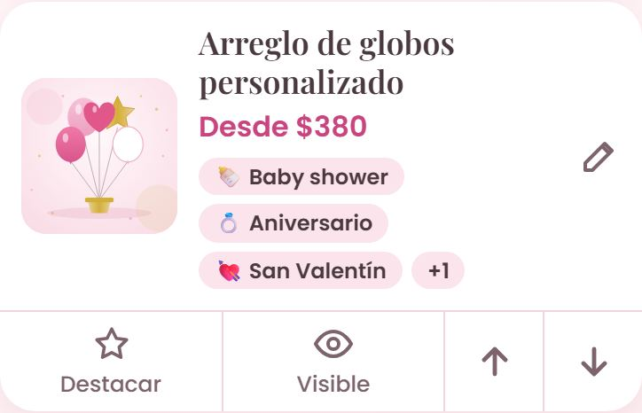

Cada tarjeta tiene botones abajo:

| Botón | Qué hace |
|---|---|
| ☆ **Destacar** | Le pone o le quita la estrella. |
| 👁 **Visible / Oculto** | Lo muestra o lo esconde del catálogo. Ideal cuando se te acaba algo. |
| ↑ ↓ | Lo sube o lo baja en la lista. |

Para **cambiar el nombre, la foto, el precio o las ocasiones**, toca la foto o el nombre del producto (o el lápiz ✏️).

---

## 5. Eliminar un producto

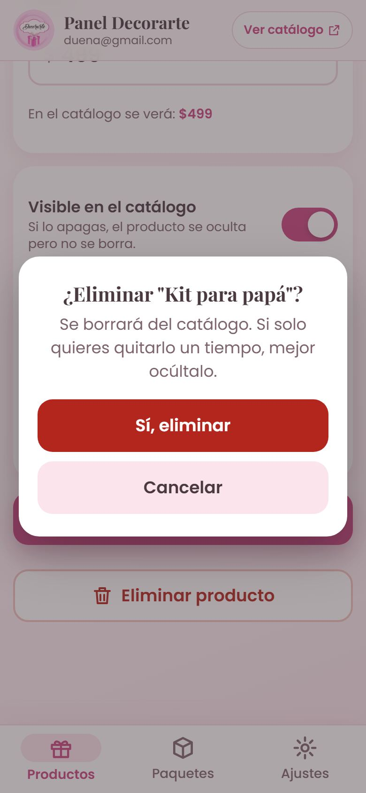

Abre el producto, baja hasta el final y toca **Eliminar producto**. Te pregunta antes de borrarlo.
Si solo quieres quitarlo por un tiempo, es mejor **ocultarlo**.

---

## 6. Paquetes de tus servicios

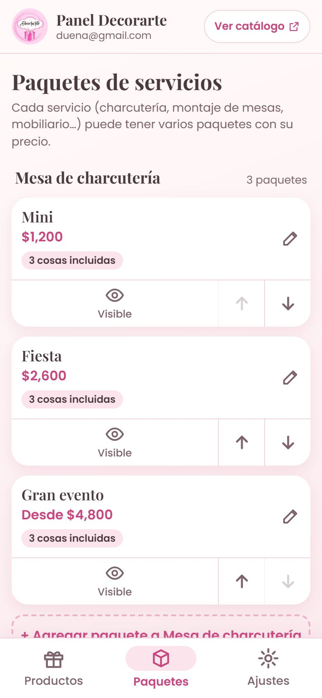
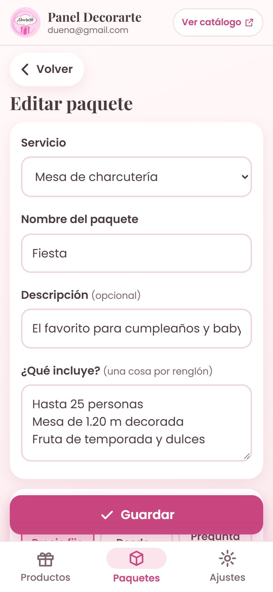

Cada servicio (charcutería, montaje de mesas, renta de mobiliario…) puede tener varios paquetes:

1. Primero crea el servicio en **Productos**, con la categoría **Servicios** y una buena foto.
2. Ve a **Paquetes** y toca **＋ Agregar paquete a…**.
3. Pon el nombre (por ejemplo, "Fiesta 25 personas"), el precio y **qué incluye**, una cosa por renglón.

En el catálogo, cada paquete tiene su botón **Cotizar** por WhatsApp.

---

## 7. Ajustes

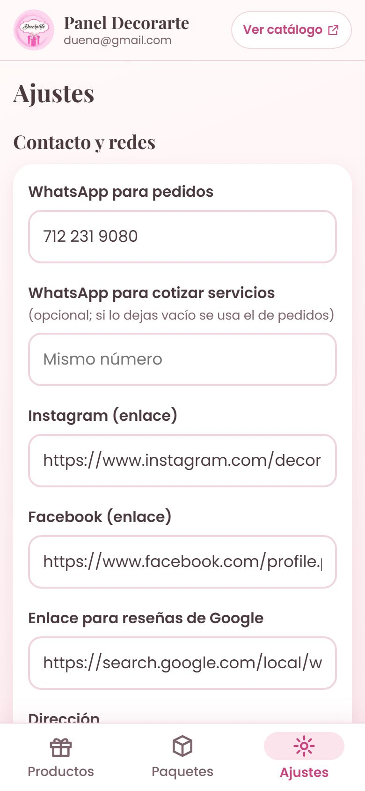
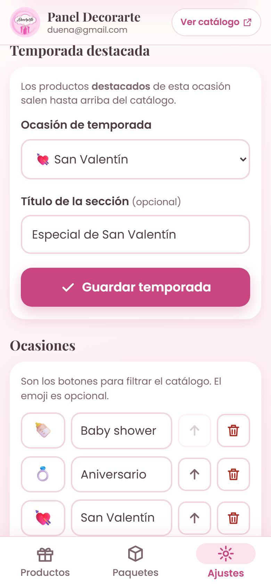
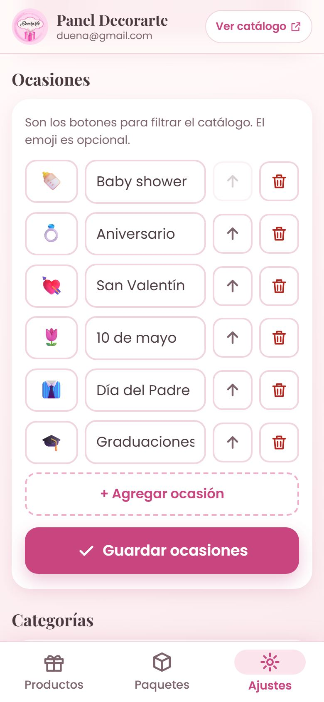

- **Contacto y redes:** tu WhatsApp, Instagram, Facebook, la dirección y el enlace de Google Maps.
  Si quieres que las **cotizaciones de servicios** lleguen a otro número, ponlo en "WhatsApp para cotizar servicios". Si lo dejas vacío, todo llega a tu número de siempre.
- **Temporada destacada:** cámbiala según la fecha (San Valentín en febrero, 10 de mayo en abril–mayo, graduaciones en junio–julio…).
  Recuerda marcar como **Destacado** los productos que quieres arriba.
- **Ocasiones** y **Categorías:** agrega, cambia el nombre o quita las que ya no uses. El emoji es opcional.
- **Personas con acceso:** si alguien te ayuda, agrega su Gmail. *(Pide que también le compartan la hoja; viene en la guía de instalación).*

Cada sección tiene su propio botón **Guardar**.

---

## 8. Si algo no sale como esperabas

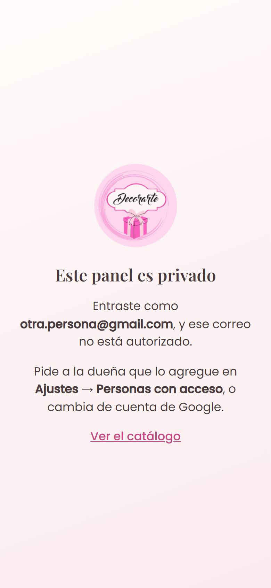

- **"Este panel es privado":** entraste con otra cuenta de Google. Cierra sesión de esa cuenta o abre el panel desde el ícono.
- **Hice un cambio y no lo veo en el catálogo:** recarga la página del catálogo una o dos veces. Los cambios tardan unos segundos.
- **Aparece un aviso rojo al guardar:** léelo. Casi siempre falta el nombre o el precio. Si dice otra cosa, toma captura de pantalla y mándala a quien te instaló el catálogo.
- **No hay internet:** el catálogo sigue mostrando a tus clientes lo último que vieron. El panel necesita internet para guardar.

## Tu información está segura

- Todo queda guardado en tu hoja **Decorarte – Catálogo** de Google Drive, que sirve de respaldo. No necesitas abrirla.
- Las fotos están en tu carpeta **Decorarte Catálogo – Fotos**. Las que borras o cambias van a la papelera de Drive, donde se pueden recuperar durante 30 días.
